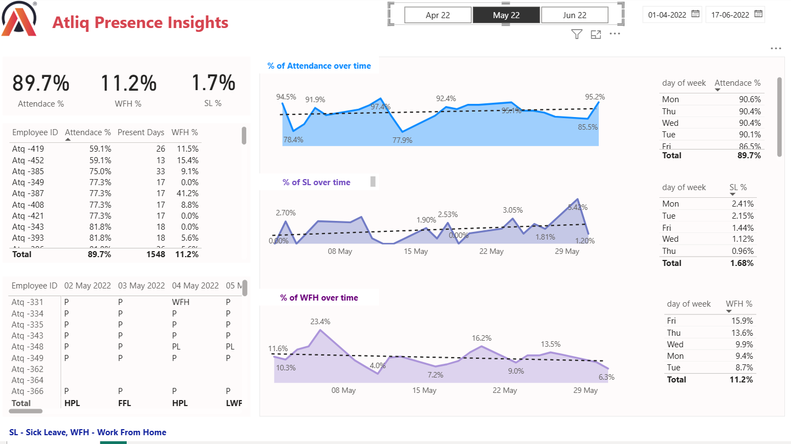

# 📊 Atliq Presence Insights Dashboard | Power BI

This project analyzes employee attendance, work-from-home (WFH), and sick leave (SL) trends using Power BI. The dashboard provides HR teams with actionable insights into workforce presence patterns and helps improve employee productivity and workplace planning.

## 🚀 Features

* Employee Attendance Tracking
* Work From Home (WFH) Analysis
* Sick Leave (SL) Monitoring
* Attendance Trends Over Time
* Day-wise Attendance Insights
* Interactive Date Filters & Slicers
* Employee-level Attendance Details

## 📂 Project Files

📁 Atliq-Presence-Insights

└── HR-Analytics-Atliq.pbix

## 🛠️ Tools & Technologies

* Power BI
* Power Query
* DAX
* Data Modeling
* Data Visualization

## 📸 Dashboard Preview

## 📊 Key Metrics

* Overall Attendance Rate: 89.7%
* Work From Home Rate: 11.2%
* Sick Leave Rate: 1.7%

## 📈 Insights Generated

* Attendance percentage trends across time
* WFH and Sick Leave patterns
* Day-wise employee presence analysis
* Individual employee attendance performance
* HR workforce planning insights

## 🎯 Business Problem

HR teams often struggle to monitor employee presence patterns effectively. This dashboard provides a centralized view of attendance, WFH, and leave data, enabling data-driven workforce management decisions.

## 📌 Learning Outcomes

* Power BI Dashboard Design
* DAX Measures
* Data Cleaning with Power Query
* Interactive Reporting
* Business Insight Generation

## 📜 License

MIT License
